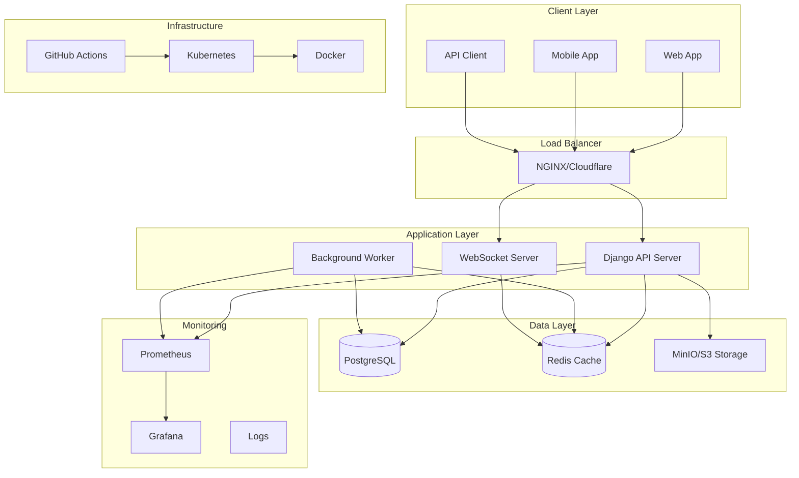

# Ephemeral Stories API

A production-ready Django REST API for ephemeral stories (24-hour expiring content) with social features, media uploads, and real-time interactions.

## 🏗️ Architecture



### Component Overview

- **Django API Server**: REST API with JWT authentication, rate limiting, and caching
- **Background Worker**: Handles story expiration and cleanup tasks
- **PostgreSQL**: Primary database for users, stories, and relationships
- **Redis**: Caching, session storage, and rate limiting
- **MinIO/S3**: Media file storage with presigned URLs
- **Prometheus**: Metrics collection and monitoring
- **Grafana**: Visualization and alerting dashboard
- **Kubernetes**: Container orchestration and auto-scaling

## 🚀 Quick Start

### Prerequisites

- Docker & Docker Compose
- Python 3.11+ (for local development)
- Make (optional, for convenience commands)

### One-Command Setup

```bash
# Clone and setup everything
git clone <repository-url>
cd assignment
make setup
```

This will:
1. Install dependencies
2. Build Docker images
3. Start all services (PostgreSQL, Redis, MinIO)
4. Run database migrations
5. Create a superuser account

### Access Points

- **API**: http://localhost:8000
- **API Documentation**: http://localhost:8000/api/schema/swagger-ui/
- **Admin Panel**: http://localhost:8000/admin
- **Health Check**: http://localhost:8000/api/health/
- **Metrics**: http://localhost:8000/metrics
- **Grafana**: http://localhost:3000 (admin/admin)
- **MinIO Console**: http://localhost:9001 (minioadmin/minioadmin)

## 📋 Environment Configuration

Copy the example environment file and configure:

```bash
cp env.example .env
```

Key environment variables:

```bash
# Django Settings
DEBUG=False
SECRET_KEY=your-secret-key-here
ALLOWED_HOSTS=localhost,127.0.0.1,your-domain.com

# Database
POSTGRES_DB=stories
POSTGRES_USER=stories_user
POSTGRES_PASSWORD=your-secure-password

# Redis
REDIS_URL=redis://localhost:6379/1

# Storage
AWS_S3_ENDPOINT_URL=http://localhost:9000
AWS_ACCESS_KEY_ID=minioadmin
AWS_SECRET_ACCESS_KEY=your-minio-password
```

## 🎯 API Walkthrough

### 1. Sign Up & Login → JWT

```bash
# Register a new user
curl -X POST http://localhost:8000/api/auth/register/ \
  -H "Content-Type: application/json" \
  -d '{
    "email": "user@example.com",
    "password": "securepassword123",
    "first_name": "John",
    "last_name": "Doe"
  }'

# Login to get JWT token
curl -X POST http://localhost:8000/api/auth/login/ \
  -H "Content-Type: application/json" \
  -d '{
    "email": "user@example.com",
    "password": "securepassword123"
  }'
```

### 2. Get Presigned URL → Upload Media

```bash
# Get presigned upload URL
curl -X POST http://localhost:8000/api/media/upload-url/ \
  -H "Authorization: Bearer YOUR_JWT_TOKEN" \
  -H "Content-Type: application/json" \
  -d '{
    "file_name": "my-photo.jpg",
    "content_type": "image/jpeg"
  }'

# Upload file to presigned URL (use the returned URL)
curl -X PUT "PRESIGNED_URL" \
  -H "Content-Type: image/jpeg" \
  --data-binary @my-photo.jpg
```

### 3. Create a Story (Public/Friends)

```bash
# Create public story
curl -X POST http://localhost:8000/api/stories/ \
  -H "Authorization: Bearer YOUR_JWT_TOKEN" \
  -H "Content-Type: application/json" \
  -d '{
    "text": "Just had an amazing day at the beach! 🏖️",
    "visibility": "public"
  }'

# Create friends-only story
curl -X POST http://localhost:8000/api/stories/ \
  -H "Authorization: Bearer YOUR_JWT_TOKEN" \
  -H "Content-Type: application/json" \
  -d '{
    "text": "Private message for close friends",
    "visibility": "friends",
    "audience_user_ids": ["user-id-1", "user-id-2"]
  }'
```

### 4. Follow a Test User, Hit /feed

```bash
# Follow another user
curl -X POST http://localhost:8000/api/follow/ \
  -H "Authorization: Bearer YOUR_JWT_TOKEN" \
  -H "Content-Type: application/json" \
  -d '{
    "followee_id": "other-user-id"
  }'

# Get personalized feed
curl -X GET http://localhost:8000/api/feed/ \
  -H "Authorization: Bearer YOUR_JWT_TOKEN"
```

### 5. View + React → Observe Real-time Events

```bash
# View a story
curl -X POST http://localhost:8000/api/stories/STORY_ID/view/ \
  -H "Authorization: Bearer YOUR_JWT_TOKEN"

# React to a story
curl -X POST http://localhost:8000/api/stories/STORY_ID/react/ \
  -H "Authorization: Bearer YOUR_JWT_TOKEN" \
  -H "Content-Type: application/json" \
  -d '{
    "emoji": "❤️"
  }'
```

### 6. Run Worker → See Expirations in Logs

```bash
# Start background worker
make worker

# Or in production
docker-compose -f docker-compose.prod.yml up worker
```

### 7. Open /metrics and Grafana Dashboard

```bash
# View Prometheus metrics
curl http://localhost:8000/metrics

# Open Grafana dashboard
make grafana
```

## 🛠️ Development Commands

```bash
# Development
make dev          # Start development environment
make test         # Run tests
make lint         # Run linting
make shell        # Django shell
make migrate      # Run migrations
make makemigrations # Create migrations

# Production
make prod         # Start production with monitoring
make prod-down    # Stop production
make prod-logs    # View production logs

# Load Testing
make load-test    # Run load tests locally
make load-test-prod # Run load tests against production

# Kubernetes
make k8s-deploy   # Deploy to Kubernetes
make k8s-delete   # Delete Kubernetes deployment
make k8s-logs     # View Kubernetes logs

# Monitoring
make metrics      # View Prometheus metrics
make grafana      # Open Grafana dashboard
make health       # Check API health
```

## 🚀 Deployment Options

### Option A: Railway (Easiest)

1. **Deploy to Railway**:
   ```bash
   # Install Railway CLI
   npm install -g @railway/cli
   
   # Login and deploy
   railway login
   railway init
   railway up
   ```

2. **Configure environment variables** in Railway dashboard

### Option B: AWS ECS / GCP Cloud Run

1. **Build and push image**:
   ```bash
   docker build -t your-registry/stories-api .
   docker push your-registry/stories-api
   ```

2. **Deploy using cloud provider's console** with managed databases

### Option C: Kubernetes (Advanced)

```bash
# Deploy to Kubernetes
make k8s-deploy

# Check deployment status
kubectl get pods -n stories-api
kubectl get services -n stories-api
```

## 📊 Monitoring & Observability

### Prometheus Metrics

The API exposes metrics at `/metrics`:

- `django_http_requests_total` - Total HTTP requests
- `django_http_request_duration_seconds` - Request duration
- `django_auth_user_total` - Total users
- `django_stories_story_total` - Total stories

### Grafana Dashboard

Access at http://localhost:3000 (admin/admin):

- Request rate and response time
- Error rates and status codes
- Database and Redis metrics
- Custom business metrics

### Health Checks

- **API Health**: `GET /api/health/`
- **Database**: Checks PostgreSQL connectivity
- **Cache**: Checks Redis connectivity
- **Storage**: Checks MinIO connectivity

## 🧪 Load Testing

### Using k6

```bash
# Install k6
# macOS: brew install k6
# Linux: https://k6.io/docs/getting-started/installation/

# Run load test
make load-test

# Run against production
make load-test-prod
```

### Load Test Results

Expected performance on a 2-core, 4GB RAM server:

- **Throughput**: 100-200 requests/second
- **Response Time**: 95th percentile < 2 seconds
- **Error Rate**: < 1%
- **Concurrent Users**: 50-100

## 🔒 Security Features

- **JWT Authentication**: Secure token-based auth
- **Rate Limiting**: Redis-based rate limiting
- **CORS Protection**: Configurable CORS policies
- **Input Validation**: Comprehensive request validation
- **SQL Injection Protection**: Django ORM protection
- **XSS Protection**: Content Security Policy headers

## 📈 Performance Optimizations

- **Redis Caching**: User feeds and following lists
- **Database Indexing**: Optimized queries
- **Connection Pooling**: Efficient database connections
- **Static File Serving**: WhiteNoise for static files
- **Gzip Compression**: Reduced response sizes
- **Query Optimization**: Select related and prefetch

## 🧪 Testing

```bash
# Run all tests
make test

# Run specific test modules
cd stories_service
python manage.py test stories.tests
python manage.py test user.tests

# Run with coverage
pip install coverage
coverage run --source='.' manage.py test
coverage report
coverage html
```

## 📝 API Documentation

- **Swagger UI**: http://localhost:8000/api/schema/swagger-ui/
- **ReDoc**: http://localhost:8000/api/schema/redoc/
- **OpenAPI Schema**: http://localhost:8000/api/schema/

## 🤝 Contributing

1. Fork the repository
2. Create a feature branch
3. Make your changes
4. Add tests
5. Run linting and tests
6. Submit a pull request

## 📄 License

This project is licensed under the MIT License - see the LICENSE file for details.

## 🆘 Troubleshooting

### Common Issues

1. **Port conflicts**: Change ports in docker-compose.yml
2. **Database connection**: Check PostgreSQL is running
3. **Redis connection**: Check Redis is running
4. **Permission errors**: Check file permissions

### Debug Commands

```bash
# Check service status
docker-compose ps

# View logs
make logs

# Check database
make db-shell

# Check Redis
make redis-cli

# Health check
make health
```

### Getting Help

- Check the logs: `make logs`
- Run health check: `make health`
- View metrics: `make metrics`
- Check Grafana: `make grafana`